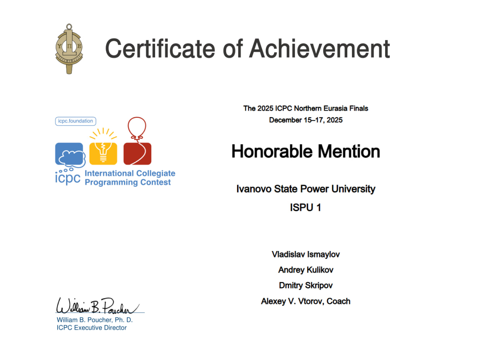

# Привет! Я Андрей 👋

  

  

ML Engineer | Python Developer | Competitive Programmer

## 🚀 О себе

- 🎓 Студент
- 🤖 Занимаюсь Machine Learning и AI
- 🏆 Codeforces: 1700+
- 📈 Разрабатываю системы прогнозирования и AI-агентов

## 🧠 Tech Stack

**Languages:** Python, C++  
**AI/ML:** PyTorch, Machine Learning, LangChain, ChromaDB  
**Backend:** FastAPI, PostgreSQL  
**Tools:** Docker, Git, Linux

## 📚 Публикации

📄 Статьи:

- 🔗 https://elibrary.ru/item.asp?id=82389281  
- 🔗 https://elibrary.ru/item.asp?id=88870520  

## 🏆 Достижения

  

